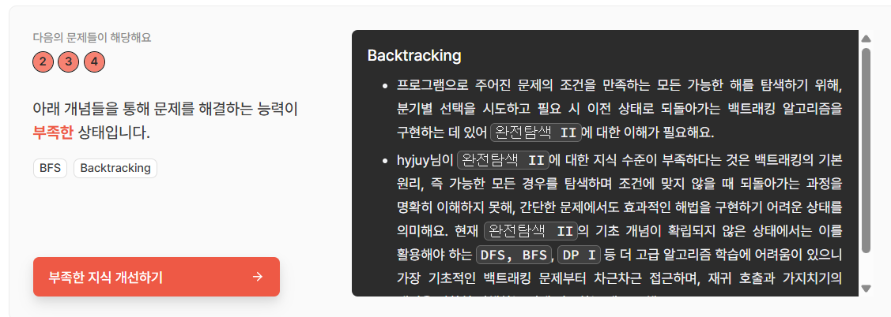

# 코드트리 청약통장 챌린지 1주차

## 주제

코드트리 청약통장 챌린지를 시작하며, 첫 주차에는 갭체크를 통해 현재 알고리즘 실력을 진단했다.

## 갭체크 결과

이번 갭체크를 통해 생각보다 기본기가 부족하다는 것을 느꼈다.  
특히 백트래킹을 풀기 위해 필요한 재귀 기반 완전탐색 구조가 약하다는 점을 확인했다.

\## 갭체크 결과 이미지

## 부족했던 부분

- 재귀 함수가 어떤 상태를 나타내는지 정리하는 능력
- 선택 후 다음 단계로 이동하는 구조
- 탐색이 끝난 뒤 이전 상태로 되돌리는 과정
- 불필요한 탐색을 줄이는 가지치기 조건

## 앞으로의 학습 계획

이번 주차에는 완전탐색 II와 백트래킹을 중심으로 학습할 계획이다.  
먼저 재귀 함수의 상태를 명확히 정의하고, 선택과 되돌리기 구조를 반복해서 연습하려고 한다.

## 블로그 후기

네이버 블로그에 작성한 후기는 아래 링크에서 확인할 수 있다.

https://blog.naver.com/hyjuy1127/224291002858

## 코드트리

https://www.codetree.ai/